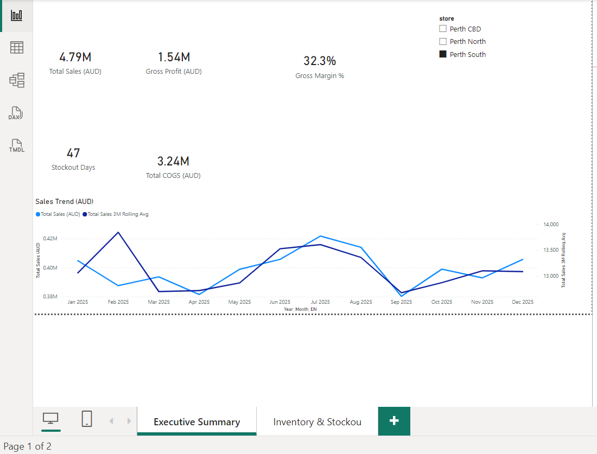
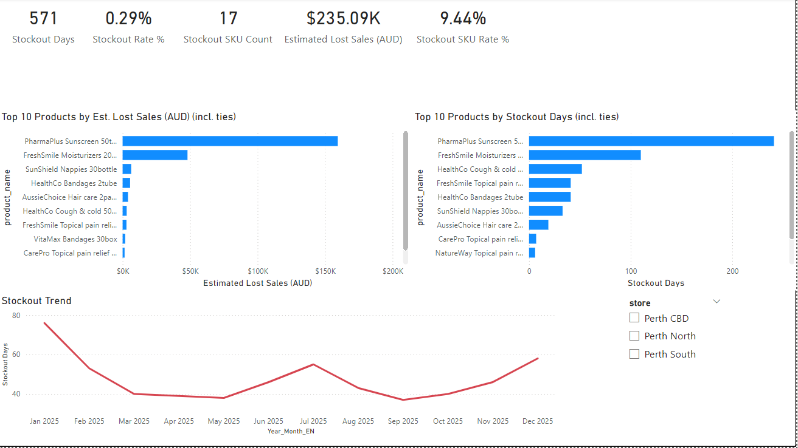

# Pharmacy Inventory & Sales Analytics (Power BI)

A portfolio project demonstrating end-to-end BI delivery for a retail pharmacy scenario: data preparation, star-schema modelling, KPI definition, and interactive dashboards for sales performance and stockout risk.

> **Data note:** This project uses a **synthetic dataset** (safe to share publicly). No employer/customer data is used.

## Dashboards

### 1) Executive Summary — Sales & Inventory
- KPI cards: Total Sales, Total COGS, Gross Profit, Gross Margin %, Stockout Days
- Monthly Sales Trend + **3-month rolling average** (secondary axis)
- Store slicer for segmentation

### 2) Inventory & Stockout
- Stockout Days KPI + monthly trend
- **Top 10 products** by Stockout Days (Top-N filter + descending sort)
- Store slicer for store-specific investigation

## Skills demonstrated
- Power BI (Power Query, modelling, visuals)
- DAX measures (profitability KPIs, rolling average)
- Star schema (dim_date, dim_store, dim_product, dim_supplier)
- Operational analytics (inventory snapshot + stockout drivers)

## Sharing
- **PBIX available upon request.**
Download the one-page case study: case-study.pdf

