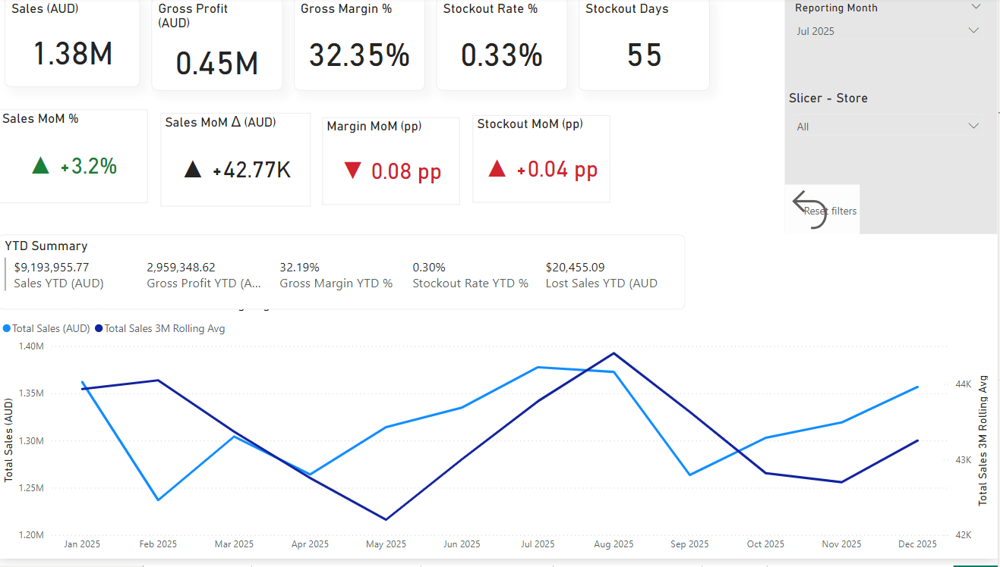

# Pharmacy Inventory & Sales Analytics (Power BI)

Portfolio project demonstrating end-to-end BI delivery for a retail pharmacy scenario: data preparation, star-schema modelling, KPI design, and interactive dashboards to monitor profitability and stockout risk.

> **Data note:** Synthetic dataset for portfolio demonstration. No employer/customer data is used.

## Highlights
- **Star schema model** (dim_date, dim_store, dim_product, dim_supplier) across sales, inventory snapshots, invoices and purchase orders
- **Advanced DAX**: KPIs, MoM variance, YTD, and 3-month rolling average
- **Stockout analytics**: Stockout Rate %, Stockout SKU Count, and **Estimated Lost Sales (AUD)** (impact-based prioritisation)
- **Interactive analysis**: Top-N drivers, **report-page tooltips**, **drill-through Product Detail**, and **Reset filters** button (Bookmarks)
- QA validation table to verify time-intelligence calculations

## Dashboards

### 1) Executive Summary
- Monthly KPIs (Sales, Profit, Margin, Stockout)
- MoM change (variance & pp) + YTD summary
- Sales trend: Actual vs 3M rolling average

### 2) Inventory & Stockout
- Stockout trend
- Top products by Stockout Days (incl. ties)
- Top products by Estimated Lost Sales (AUD)

## How to use
1. Select **Reporting Month** and **Store**
2. Hover on Top-N bars to view **tooltips**
3. Right-click a product to **drill through** to Product Detail
4. Click **Reset filters** to return to the default view

## Files
- Screenshots are stored in `/assets`
- `case-study.pdf` (optional) — recruiter-friendly one-page summary
- PBIX available upon request
